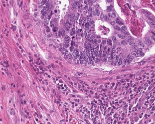

# MSIfromHE
Predict microsatellite status from hematoxylin-eosin histology of gastrointestinal cancer

## what is this?
This is the source code for an unpublished project currently under review at a scientific journal. To reproduce the codes, you need to download histological whole slide images from TCGA as noted in the manuscript and install the following dependencies:

- Color normalization toolbox (https://warwick.ac.uk/fac/sci/dcs/research/tia/software/sntoolbox/)
- MatSurv (https://de.mathworks.com/matlabcentral/fileexchange/64582-matsurv)

The codes are written in MATLAB and are thoroughly commented. For a more detailed description of the method, please refer to the manuscript which will be linked here after acceptance. 

